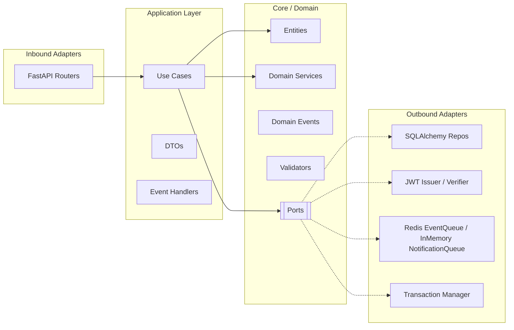

# Auth Service — Hexagonal Architecture

[](https://github.com/CaseyJohnson-RS/Hexagonal-Auth-Service/actions)


Сервис аутентификации на **FastAPI**, построенный по гексагональной архитектуре
(Ports & Adapters). Доменное ядро не зависит ни от одного фреймворка — вся
инфраструктура (БД, HTTP, токены, шина событий) спрятана за порт-интерфейсами и
подключается через адаптеры. Цель проекта — показать чистую декомпозицию и
безопасную работу с токенами на полном цикле управления учётной записью.

Полный цикл: регистрация → подтверждение email → вход → ротация токенов →
смена и восстановление пароля, с журналом security-событий.

## Ключевые решения

- **Доменное ядро без зависимостей.** Слой `core/` не импортирует FastAPI или
  SQLAlchemy. Порты описаны как `typing.Protocol` — адаптеры удовлетворяют их
  структурно, без наследования от общих базовых классов.
- **Токены хранятся только как SHA-256-хэши.** Refresh- и одноразовые токены
  попадают в БД исключительно в хэшированном виде — сырой токен не сохраняется
  никогда.
- **Ротация refresh-токенов с детектом повторного использования.** При ротации
  старый токен отзывается и помечается «заменён на …»; попытка переиспользовать
  отозванный токен поднимает `RefreshTokenReuse`.
- **Оптимистичные блокировки.** У сущностей версионируемое поле; `UPDATE`
  выполняется `WHERE version = ожидаемая`, и при расхождении поднимается
  `ConcurrencyError` (HTTP 409) — защита от потерянных обновлений при гонке.
- **Анти-энумерация.** Запрос восстановления пароля всегда возвращает `200`,
  чтобы по ответу нельзя было определить, существует ли учётная запись.

## Архитектура

Зависимости направлены строго в одну сторону: `adapters → application → core`.



**Слои:**

- **Core / Domain** (`app/core/`) — бизнес-правила без внешних зависимостей.
  Сущности порождают доменные события; порты — это `Protocol`-классы.
- **Application** (`app/application/`) — use cases, оркеструющие домен. Каждый
  получает порты через конструктор, выполняется в транзакции и публикует
  события после коммита.
- **Adapters** (`app/adapters/`) — конкретные реализации портов: inbound (HTTP
  через FastAPI) и outbound (PostgreSQL через SQLAlchemy, JWT, Redis EventQueue
  для аудит-событий, InMemory NotificationQueue для токенных уведомлений).
- **Composition Root** (`app/adapters/nexus.py`) — единственное место, где порты
  связываются с адаптерами.

## Технологии

| Слой | Технология |
|---|---|
| HTTP | FastAPI + Uvicorn |
| База данных | PostgreSQL 16 (async, asyncpg) |
| ORM | SQLAlchemy 2 (async) |
| Миграции | Alembic |
| Токены | PyJWT (access, HS256) + refresh/одноразовые в БД (SHA-256) |
| Хэш пароля | bcrypt (прямой вызов) |
| Шина событий | Redis (DomainEvent, персистентно) + in-memory (NotificationEvent) |
| Валидация / конфиг | Pydantic v2, pydantic-settings |
| Контейнеризация | Docker, Docker Compose |
| Зависимости | uv |
| Линтер | Ruff |
| Тесты | pytest + pytest-asyncio + httpx |

## HTTP API

Все эндпоинты под `/auth/api/`:

| Метод | Путь | Назначение |
|---|---|---|
| POST | `/register` | Регистрация → выдаётся OTT для подтверждения email |
| POST | `/verify_email` | Подтверждение email по OTT |
| POST | `/token` | Вход → access + refresh |
| POST | `/refresh` | Ротация refresh → новая пара |
| POST | `/revoke` | Отзыв refresh-токена |
| POST | `/password/change` | Смена пароля (Bearer + старый пароль) |
| POST | `/password/recover_request` | Запрос восстановления (всегда 200) |
| POST | `/password/recover` | Восстановление по одноразовому токену |
| GET | `/auth/audit/events/` | HTML-страница журнала событий (пагинация) |

## Примеры запросов

```bash
# 1. Регистрация → создаётся пользователь, выдаётся одноразовый токен (OTT) для подтверждения email
curl -X POST http://localhost:8000/auth/api/register \
  -H "Content-Type: application/json" \
  -d '{"email": "user@example.com", "password": "strong-password"}'

# 2. Подтверждение email по одноразовому токену
curl -X POST http://localhost:8000/auth/api/verify_email \
  -H "Content-Type: application/json" \
  -d '{"one_time_token": "<token-из-письма>"}'

# 3. Вход → пара токенов
curl -X POST http://localhost:8000/auth/api/token \
  -H "Content-Type: application/json" \
  -d '{"email": "user@example.com", "password": "strong-password"}'
# → {"refresh_token": "...", "access_token": "...", "token_type": "bearer"}

# 4. Ротация refresh-токена → новая пара, старый отзывается
curl -X POST http://localhost:8000/auth/api/refresh \
  -H "Content-Type: application/json" \
  -d '{"refresh_token": "<refresh_token>"}'

# 5. Смена пароля (требуется access-токен; пользователь берётся из токена)
curl -X POST http://localhost:8000/auth/api/password/change \
  -H "Authorization: Bearer <access_token>" \
  -H "Content-Type: application/json" \
  -d '{"old_password": "strong-password", "new_password": "new-strong-password"}'
```

## Быстрый старт

```bash
git clone https://github.com/CaseyJohnson-RS/Hexagonal-Auth-Service
cd Hexagonal-Auth-Service
cp .env.example .env        # заполнить JWT_SECRET и параметры БД
docker compose up
```

- API-документация: **http://localhost:8000/docs**
- Журнал security-событий: **http://localhost:8000/auth/audit/events**

При старте автоматически применяются Alembic-миграции.

## Тесты

```bash
# поднять тестовую БД
docker compose up -d postgres

# прогнать всё
make test-all
```

Тесты покрывают все уровни:

- **Unit** — доменные сущности, доменные сервисы, валидаторы.
- **Интеграционные (репозитории)** — против реальной PostgreSQL.
- **Интеграционные (API)** — сквозные вызовы через `httpx` + `ASGITransport`.

CI (`.github/workflows/ci.yml`) на каждый push гоняет линтер Ruff, затем unit- и
интеграционные тесты против сервис-контейнера PostgreSQL 16.

## Структура

```
app/
├── core/            # домен без импортов фреймворков
│   ├── domain/      # entities, events, services, validators, exceptions
│   ├── ports/       # порт-интерфейсы (Protocol)
│   └── utils/       # security- и time-хелперы
├── application/     # use cases, DTO, обработка событий
├── adapters/
│   ├── inbound/http/    # FastAPI-роутеры, схемы запросов/ответов
│   ├── outbound/        # SQLAlchemy-репозитории, JWT, in-memory шина
│   └── nexus.py         # composition root (DI)
├── infrastructure/
│   ├── db/          # async-фабрика сессий PostgreSQL
│   └── redis/       # фабрика Redis-клиента
├── config/              # Pydantic Settings
└── main.py
```